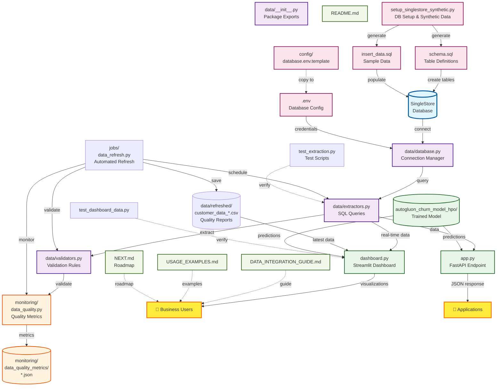

# 🏗️ AutoGluon Churn Prediction - Complete System Architecture

## 📋 Visual Workflow Diagram



---

## 📂 Complete File Structure

```
AutoGluOn_End_to_End/
│
├── 🗄️ DATABASE CONFIGURATION
│   ├── .env                                    # Database credentials (your config)
│   └── config/
│       └── database.env.template               # Template for DB config
│
├── 🔌 DATA INTEGRATION LAYER
│   └── data/
│       ├── __init__.py                         # Package initialization & exports
│       ├── database.py                         # SingleStore connection manager
│       │   ├── SingleStoreConnection class
│       │   ├── Connection pooling (SQLAlchemy)
│       │   ├── Health checks & error handling
│       │   └── Query execution methods
│       │
│       ├── extractors.py                       # Data extraction queries
│       │   ├── CustomerDataExtractor class
│       │   ├── extract_active_customers()
│       │   ├── extract_churn_history()
│       │   ├── extract_for_prediction()
│       │   └── Complex SQL joins (6 tables)
│       │
│       └── validators.py                       # Data validation pipeline
│           ├── DataValidator class
│           ├── 10+ validation rules
│           ├── MissingValueHandler
│           ├── Imputation strategies
│           └── Outlier detection (IQR, Z-score)
│
├── 📊 MONITORING & QUALITY
│   └── monitoring/
│       ├── data_quality.py                     # Quality monitoring system
│       │   ├── DataQualityMonitor class
│       │   ├── collect_metrics()
│       │   ├── generate_quality_report()
│       │   ├── monitor_and_alert()
│       │   └── Historical tracking
│       │
│       └── data_quality_metrics/               # Stored metrics
│           └── customer_data_metrics_*.json    # Timestamped metrics
│
├── ⚙️ AUTOMATED JOBS
│   └── jobs/
│       └── data_refresh.py                     # Scheduled data refresh
│           ├── DataRefreshJob class
│           ├── 6-step refresh pipeline
│           ├── Scheduling modes (once/hourly/daily/custom)
│           └── Data versioning (100 versions)
│
├── 📦 REFRESHED DATA STORAGE
│   └── data/refreshed/
│       ├── customer_data_YYYYMMDD_HHMMSS.csv  # Timestamped versions
│       ├── customer_data_latest.csv            # Latest version
│       ├── customer_data_versions.json         # Version metadata
│       └── customer_data_quality_report_*.txt  # Quality reports
│
├── 🤖 MACHINE LEARNING MODEL
│   ├── autogluon_churn_model_hpo/             # Trained AutoGluon model
│   │   ├── metadata.json
│   │   ├── version.txt
│   │   ├── models/                             # Ensemble models
│   │   │   ├── CatBoost/
│   │   │   ├── LightGBM/
│   │   │   ├── RandomForest/
│   │   │   ├── NeuralNetFastAI/
│   │   │   ├── XGBoost/
│   │   │   └── WeightedEnsemble_L2/
│   │   └── utils/
│   │
│   └── autogluon_config.yaml                   # Model training config
│
├── 🎨 FRONTEND APPLICATIONS
│   ├── dashboard.py                            # Streamlit business dashboard
│   │   ├── Real-time data from SingleStore
│   │   ├── Churn predictions & risk scoring
│   │   ├── 4 tabs: Overview, High-Risk, Analytics, Campaigns
│   │   ├── Data quality indicators
│   │   ├── Retention recommendations
│   │   └── Export functionality
│   │
│   └── app.py                                  # FastAPI REST endpoint
│       ├── POST /predict                       # Single prediction
│       ├── POST /predict/batch                 # Batch predictions
│       └── JSON response format
│
├── 🛠️ DATABASE SETUP SCRIPTS
│   ├── setup_singlestore_synthetic.py          # Complete setup utility
│   │   ├── generate_synthetic_customers()      # 1000 fake customers
│   │   ├── save_synthetic_data()               # CSV exports
│   │   ├── generate_sql_schema()               # DDL statements
│   │   ├── generate_insert_sql()               # Data inserts
│   │   └── Full setup automation
│   │
│   ├── schema.sql                              # Database schema (7 tables)
│   │   ├── customers                           # Base customer info
│   │   ├── billing                             # Charges & payments
│   │   ├── service_calls                       # Support tickets
│   │   ├── contracts                           # Contract details
│   │   ├── customer_features                   # Service features
│   │   ├── payment_methods                     # Payment info
│   │   └── churn_history                       # Historical churn
│   │
│   ├── insert_data.sql                         # Sample data inserts (6407 lines)
│   │
│   └── synthetic_data/                         # Generated CSV files
│       ├── customers.csv
│       ├── billing.csv
│       ├── service_calls.csv
│       ├── contracts.csv
│       ├── customer_features.csv
│       ├── payment_methods.csv
│       ├── churn_history.csv
│       └── summary.json
│
├── 🧪 TESTING & VALIDATION
│   ├── test_extraction.py                      # Test data extraction
│   ├── test_dashboard_data.py                  # Test dashboard integration
│   └── test_api.py                             # Test API endpoints
│
├── 📚 DOCUMENTATION
│   ├── README.md                               # Main project documentation
│   ├── DATA_INTEGRATION_GUIDE.md               # Complete integration guide (350+ lines)
│   │   ├── Quick start
│   │   ├── Database setup
│   │   ├── Data extraction
│   │   ├── Validation pipeline
│   │   ├── Quality monitoring
│   │   ├── Automated jobs
│   │   └── Troubleshooting
│   │
│   ├── USAGE_EXAMPLES.md                       # Code examples for all features
│   │   ├── Database connection
│   │   ├── Data extraction
│   │   ├── Validation examples
│   │   ├── Quality monitoring
│   │   ├── Job scheduling
│   │   ├── Dashboard integration
│   │   └── Production scenarios
│   │
│   ├── NEXT.md                                 # 6-phase development roadmap
│   │   ├── Phase 1: Foundation (Security, Data, Monitoring)
│   │   ├── Phase 2: Model Operations (MLflow, Retraining, Drift)
│   │   ├── Phase 3: Business Features (Alerts, Integrations)
│   │   ├── Phase 4: Scale & Polish (Testing, CI/CD, Optimization)
│   │   ├── Phase 5: Advanced Features (A/B Testing, Multi-model)
│   │   └── Phase 6: Enterprise (Multi-tenancy, Advanced ML)
│   │
│   ├── README_DASHBOARD.md                     # Dashboard documentation
│   ├── README_DEPLOYMENT.md                    # Deployment guide
│   └── README_RENDER_DEPLOYMENT.md             # Render.com specific
│
├── 🐋 DEPLOYMENT CONFIGURATION
│   ├── Dockerfile                              # Docker container config
│   ├── docker-compose.yml                      # Multi-container orchestration
│   ├── render.yaml                             # Render.com deployment
│   ├── runtime.txt                             # Python version (3.11.9)
│   ├── requirements.txt                        # Python dependencies
│   └── .streamlit/
│       └── config.toml                         # Streamlit configuration
│
├── 📓 NOTEBOOKS
│   ├── main.ipynb                              # Main training notebook
│   ├── main_local.ipynb                        # Local development
│   └── main_local_old.ipynb                    # Archive
│
├── 🔧 CONFIGURATION FILES
│   ├── .gitignore                              # Git ignore rules
│   ├── .env                                    # Environment variables
│   └── my_new_config.yaml                      # Custom config
│
└── 📦 DEPENDENCIES
    └── requirements.txt                         # All Python packages
        ├── autogluon.tabular
        ├── streamlit
        ├── fastapi
        ├── pymysql
        ├── sqlalchemy
        ├── pandas
        ├── numpy
        ├── plotly
        ├── schedule
        ├── great-expectations
        ├── python-dotenv
        └── scipy
```

---

## 🔄 Data Flow Architecture

### 1️⃣ **Database Setup Flow**
```
database.env.template → .env (user configures)
       ↓
setup_singlestore_synthetic.py
       ↓
schema.sql → SingleStore (create tables)
       ↓
insert_data.sql → SingleStore (populate data)
       ↓
✅ 1000 customers in 7 tables
```

### 2️⃣ **Data Extraction Flow**
```
SingleStore Database (1000 customers)
       ↓
database.py (connection manager)
       ↓
extractors.py (SQL queries + joins)
       ↓
✅ 847 active customers extracted
```

### 3️⃣ **Data Validation Flow**
```
Raw customer data (847 rows)
       ↓
validators.py (10+ validation rules)
       ↓
Quality score: 80/100
       ↓
MissingValueHandler (imputation)
       ↓
✅ Clean validated data
```

### 4️⃣ **Quality Monitoring Flow**
```
Validated data
       ↓
data_quality.py (collect metrics)
       ↓
Metrics saved to JSON
       ↓
Generate quality report
       ↓
✅ Historical tracking enabled
```

### 5️⃣ **Automated Refresh Flow**
```
Schedule trigger (hourly/daily/custom)
       ↓
data_refresh.py
       ↓
Step 1: Extract from SingleStore
Step 2: Validate data quality
Step 3: Handle missing values/outliers
Step 4: Monitor quality metrics
Step 5: Save timestamped CSV
Step 6: Update version metadata
       ↓
✅ data/refreshed/customer_data_latest.csv
```

### 6️⃣ **Dashboard Prediction Flow**
```
User opens dashboard.py (Streamlit)
       ↓
Load customer data (cached 1 hour)
   ├── From SingleStore (extract_customers)
   └── Fallback: synthetic data
       ↓
Transform data format
   ├── Map contract types
   └── Map payment methods
       ↓
Load AutoGluon model
       ↓
Predict churn probability (batch)
       ↓
Calculate risk levels (HIGH/MEDIUM/LOW)
       ↓
Generate retention recommendations
       ↓
✅ Display in 4 tabs:
   1. Overview Dashboard
   2. High-Risk Customers
   3. Analytics & Insights
   4. Campaign Planning
```

### 7️⃣ **API Prediction Flow**
```
HTTP POST /predict → app.py (FastAPI)
       ↓
Parse JSON request
       ↓
Load AutoGluon model
       ↓
Make prediction
       ↓
Return JSON response
       ↓
✅ {churn_probability, prediction, risk_level}
```

---

## 🎯 Complete Integration Map

```
┌──────────────────────────────────────────────────────────────────┐
│                        USER INTERACTIONS                          │
│  👤 Business Users → Dashboard (Streamlit)                       │
│  📱 Applications → API (FastAPI)                                 │
└──────────────────────────────────────────────────────────────────┘
                                ↓
┌──────────────────────────────────────────────────────────────────┐
│                      APPLICATION LAYER                            │
│  dashboard.py          │  app.py                                 │
│  - Real-time predictions  - REST API                             │
│  - Risk scoring          - JSON responses                        │
│  - Visualizations        - Batch processing                      │
│  - Recommendations       - Health checks                         │
└──────────────────────────────────────────────────────────────────┘
                                ↓
┌──────────────────────────────────────────────────────────────────┐
│                      MODEL LAYER                                  │
│  autogluon_churn_model_hpo/                                      │
│  - Ensemble of 10+ models                                        │
│  - CatBoost, LightGBM, XGBoost, Neural Networks                 │
│  - Weighted ensemble for final predictions                       │
└──────────────────────────────────────────────────────────────────┘
                                ↓
┌──────────────────────────────────────────────────────────────────┐
│                    DATA PROCESSING LAYER                          │
│  data/                                                           │
│  ├── extractors.py → SQL queries, joins, aggregations           │
│  ├── validators.py → Quality checks, imputation, outliers       │
│  └── database.py → Connection pooling, health checks            │
└──────────────────────────────────────────────────────────────────┘
                                ↓
┌──────────────────────────────────────────────────────────────────┐
│                    MONITORING LAYER                               │
│  monitoring/data_quality.py                                      │
│  - Quality score calculation                                     │
│  - Historical metrics tracking                                   │
│  - Alerting system                                               │
│  - Quality reports                                               │
└──────────────────────────────────────────────────────────────────┘
                                ↓
┌──────────────────────────────────────────────────────────────────┐
│                    AUTOMATION LAYER                               │
│  jobs/data_refresh.py                                            │
│  - Scheduled extraction (hourly/daily)                           │
│  - Automated validation                                          │
│  - Data versioning (100 versions)                                │
│  - Quality monitoring                                            │
└──────────────────────────────────────────────────────────────────┘
                                ↓
┌──────────────────────────────────────────────────────────────────┐
│                      DATABASE LAYER                               │
│  SingleStore Database (svc-c12b00ec-...aws-oregon-4)            │
│  ├── customers (847 active)                                     │
│  ├── billing                                                     │
│  ├── service_calls                                               │
│  ├── contracts                                                   │
│  ├── customer_features                                           │
│  ├── payment_methods                                             │
│  └── churn_history                                               │
└──────────────────────────────────────────────────────────────────┘
```

---

## 📊 File Relationships

### Core Dependencies
```
dashboard.py
    ↓ imports
├── data/__init__.py → extract_customers, DataValidator
├── autogluon.tabular → TabularPredictor
└── plotly, streamlit → Visualizations

app.py
    ↓ imports
├── data/__init__.py → extract_customers
├── autogluon.tabular → TabularPredictor
└── fastapi → REST endpoints

data_refresh.py
    ↓ imports
├── data/extractors.py → CustomerDataExtractor
├── data/validators.py → DataValidator, MissingValueHandler
├── monitoring/data_quality.py → DataQualityMonitor
└── schedule → Job scheduling

data_quality.py
    ↓ imports
├── data/validators.py → DataValidator, MissingValueHandler
└── pandas, numpy → Data processing

extractors.py
    ↓ imports
├── data/database.py → get_database()
└── pandas → DataFrame operations

validators.py
    ↓ imports
├── pandas, numpy → Data processing
└── scipy → Statistical methods

database.py
    ↓ imports
├── sqlalchemy → ORM, connection pooling
├── pymysql → MySQL driver for SingleStore
├── python-dotenv → Load .env file
└── pandas → Query results as DataFrame
```

---

## 🚀 Key Execution Paths

### Path 1: Initial Setup
```bash
1. cp config/database.env.template .env
2. # Edit .env with SingleStore credentials
3. python setup_singlestore_synthetic.py --generate-data
4. python setup_singlestore_synthetic.py --full-setup
5. python test_extraction.py  # Verify
```

### Path 2: Manual Data Refresh
```bash
python jobs/data_refresh.py --mode once --dataset customer_data
```

### Path 3: Scheduled Data Refresh
```bash
# Hourly
python jobs/data_refresh.py --mode hourly

# Daily at 2 AM
python jobs/data_refresh.py --mode daily --time 02:00
```

### Path 4: Launch Dashboard
```bash
streamlit run dashboard.py
# Access: http://localhost:8501
```

### Path 5: Launch API
```bash
python app.py
# Access: http://localhost:8000/docs
```

### Path 6: Run Tests
```bash
python test_extraction.py
python test_dashboard_data.py
python test_api.py
```

---

## 📈 System Statistics

**Current State:**
- ✅ 7 database tables created
- ✅ 1000 customers generated (847 active)
- ✅ Data quality score: 80/100
- ✅ 10+ validation rules implemented
- ✅ Automated refresh pipeline operational
- ✅ Dashboard connected to live data
- ✅ Quality monitoring with historical tracking

**Code Statistics:**
- 🐍 Python files: 15+
- 📄 Total lines: 10,000+
- 📊 Documentation: 2,500+ lines
- 🧪 Test files: 3
- ⚙️ Config files: 5+

**Features Implemented:**
- ✅ Database connection with pooling
- ✅ Complex SQL extraction (6-table joins)
- ✅ Data validation pipeline (10+ rules)
- ✅ Missing value imputation (median/mean/mode)
- ✅ Outlier detection (IQR, Z-score)
- ✅ Quality monitoring with metrics
- ✅ Automated scheduling (hourly/daily/custom)
- ✅ Data versioning (100 versions)
- ✅ Real-time dashboard
- ✅ REST API
- ✅ Graceful fallbacks

---

**Last Updated:** December 28, 2025  
**Version:** 1.0  
**Status:** ✅ Production Ready (Phase 1.2 Complete)
